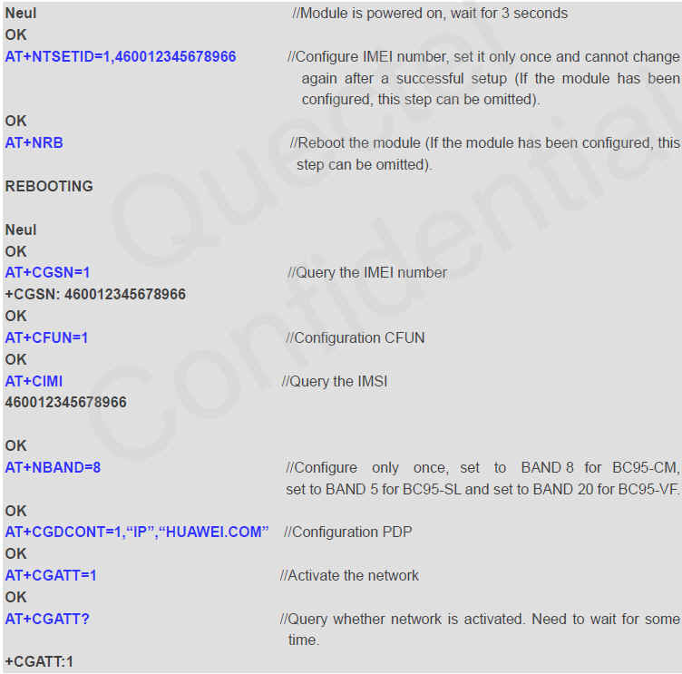

# 无NB-IoT网络，实现数据从以太网口上报

对于已经部署了NB网络的情况，需要按照如下步骤对NB模块进行初始配置。

1. 使用串口连接NB-IoT模块，这一步骤我们已经在搭建开发环境时完成。
2. 在PC端用串口调试软件打开串口终端。
3. 按下开发板上NB模块复位按键，能够看到复位后串口打印“Neul OK”。接下来将使用AT命令对模块进行配置，命令详情可以参考[Quectel_BC95_AT_Commands_Manual_V1.1](https://github.com/softbaddog/iot-codelabs/tree/master/1-nbiot-liteos-oceanconnect/docs/chips%20or%20modules/Quectel)
4. 输入“AT+CFUN=0"。
5. 设置IoT平台的ip地址和端口，输入“AT+NCDP=112.93.129.156,5683”，这里的IP和端口即来自我们先前申请的OceanConnect账号，对应其中的“设备对接信息”。
6. 输入“AT+CFUNC=1”。
7. 输入“AT+NRB”重启模块。
8. 在串口终端中依次输入如下AT指令，将模块连接到运营商网络。

完成后，AT+CGATT?查询attatch状态，返回结果为1表示已经成功接入网络。

**注意**

> AT+NBAND设置的band号，要根据NB-IoT模组的型号来设置，如我手上的BC95-**B8**。注意NB模块的名称，BC95-B8和BD95-B5分别对应900MHz（移动，联调）与850MHz（电信）频段，需插入对应运营商的SIM 卡，不可混用。
