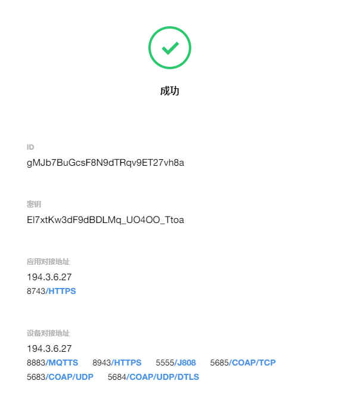
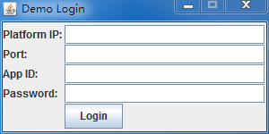
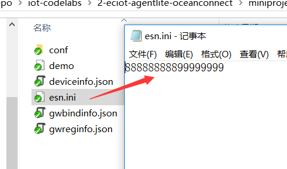
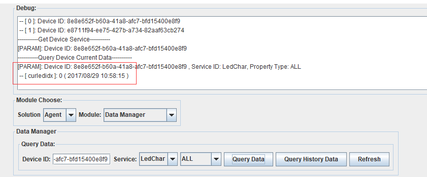
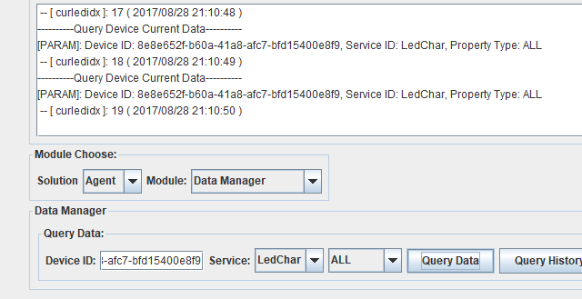

## 在OceanConnect平台上创建应用

- 使用OceanConnect申请到的账号，访问其提供的平台Portal地址。

- 创建应用，名称为“ECIOT_Demo”，所属行业修改为“基础API包”。

- 创建成功后，会显示APP ID、密钥、北向应用对接地址、南向设备对接地址，这几项内容后面会用到，需要拷贝记录下来。

 

至此，应用创建完成。

## 上传Profile和编解码插件

接下来我们需要上传profile和编解码插件（这里我们直接拿做好的内容进行演示）。

- 在平台Portal页面左边找到设备管理->模型->导入模型。然后在页面右上角有个上传的按钮，如下图所示。

- 将制作好的profile文件上传，示例profile可以从这里[下载](https://github.com/softbaddog/iot-codelabs/tree/master/2-eciot-agentlite-oceanconnect/tools/profile)。

## 使用北向APP注册设备

北向应用demo程序是IoT平台提供的一个demo程序，用来给用户参考实现自己的定制化APP的。通过该demo程序用户可以了解如何进行设备注册，设备更新，查询数据，下发命令等IoT平台提供的基础能力。注册设备的步骤如下：

1. 打开北向应用APP。
2. 输入平台ip、端口、app id、password，先前我们从OceanConnect申请账号时，已经获取到IP和端口，ID和密码是我们在平台Portal上创建应用成功后取得的。

3. 登录成功后，进入Device Manager界面，输入node id和verify code进行注册。

4. node id和verify code取值相同，来自`esn.ini`中的MAC地址，两者保持一致即可。

5. 注册成功后，在北向APP内会显示返回的Device ID，需要记录下来以便后续根据此ID查询、修改设备配置信息。

6. 此时，我们登录平台Portal，能够看到此Device ID的设备已经成功注册，且。

## 南向设备运行并上报数据

4. 按照下图中的内容进行数据查询，可以看到南向设备上报LedChar的数据默认值为0。

## 向南向设备下发控制命令

除了能够查询数据，北向应用还可以给设备下发命令（如果设备profile中编写了命令相关的内容，这里我们提供制作好的profile，可以模拟设置南向设备LED的亮度）。命令下发在Command Manager下，如下图所示：

**执行修改参数**

**执行滚动命令**

下发命令成功后，再次通过Data Manager查询，发现上报的数据发生相应的改变，到此南向设备到OceanConnect上报数据、下发命令已全程打通，贡献你顺利通关。